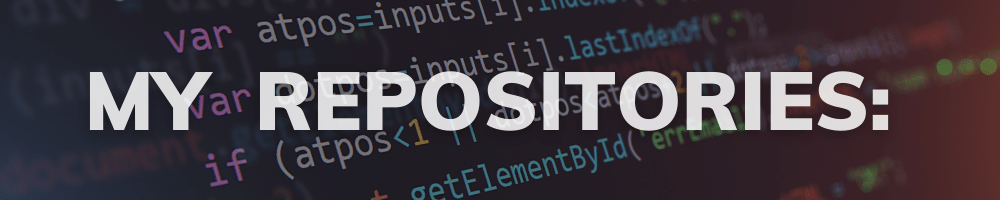

<h1 align="center">
    
</h1>
    

    
🧑 Gender:Male

    
🎒 Studying Computer Science at HCM Open University

    
🧑‍💻 Frontend and Android Developer

    
✅ Missions:

    <ul>
        <li>Learning IT, CS and Android Development (ongoing)</li>
        <li>Complete NIIS application, a programming learning application</li>
        <li>Complete the website to support learning methods 2-1-2 and 1-0-0 (near future)</li>
    </ul>

# 🌐 Socials
   

# 💻 Tech Stack
## Languages

     

## Other Skill

    
     

# 📈 My stats

    
    

 

